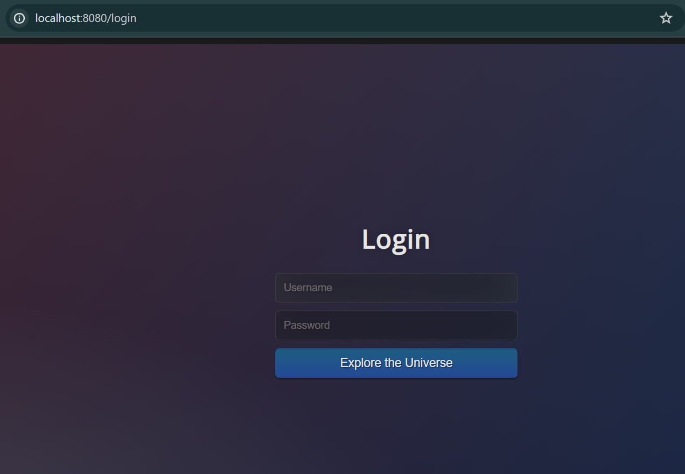
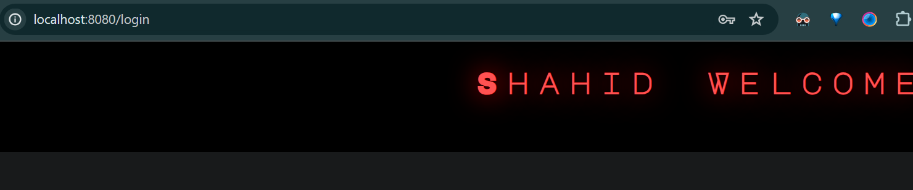

## Quick Web Application using JSP & Servlets

#### Set up 

- Get the root directory which contains the pom.xml
- Power up the app using `mvn clean` & `mvn install`
- Then trigger the tomcat server using `mvn tomcat67:run`
- Head to `port:8080/login`




#### Details 

- The web app consists of JSP pages along with Servlet business logics to handle the requests
- App consists of various endpoints such as `/login`, `/welcome`, `/resource` etc..
- The application is currently WIP

### Refactor quick app to use Spring-MVC

- Added a spring-mvc dependency 
- ```
  <dependency>
  <groupId>org.springframework</groupId>
  <artifactId>spring-webmvc</artifactId>
  <version>4.2.2.RELEASE</version>
  </dependency>
  ```
- Add the servlet in `web.xml`


### Spring Application flow

- Request comes to Dispatcher => controller/JSP/Servlet : this pattern is called _front controller pattern_
- The Dispatcher servlet is defined in `web.xml`
- Dispatcher servlet based on url in controller, trigger the request at specified endpoint ex : `/login`
- Typically we show the info as JSP page in web browser, therefore, the response of controller is a view
- We have to tell dispatcher that these views are present with `prefix(filename) + suffix(.jsp)`
- To handle this, we have a bean called `viewResolver`, present in class `class="org.springframework.web.servlet.view.InternalResourceViewResolver"`

### Architecture of Spring mvc


- The incoming request comes to dispatcher(front controller)
- The dispatcher searches for the right `endpoint` to `route` the request
- Once the dispatcher finds the right route, the request goes to the controller to handle the request endpoint
- Controller performs some operations such as return a `web page`, the controller tells the dispatcher which view to be rendered
- Then the dispatcher talks to viewResolver to get the display view
- Finally, the dispatcher then renders the request, executes the request & sends the response back


### Annotations
 Spring supports various annotations, lets understand them 

| Annotations     | Defined Level     | Description                                                                                             |
|-----------------|-------------------|---------------------------------------------------------------------------------------------------------|
| @Controller     | Class             | informs the dispatcher servelet that this controller handles the incoming request at specified endpoint |
| @RequestMapping | method            | helps in declaring the custom endpoint                                                                  |
| @ResponseBody   | method            | Informs dispatcher to return a method response as http response in web page                             |
| @RequestMapping | method-parameter  | Handles to get the parameters from the view                                                             |
| @Service        | Class             | Business Service logic                                                  |
| @Component        | Class             | Generic inorder to defined the bean to be created                                                        |
| @Repository        | method             | The @Repository annotation in Spring Boot is a stereotype annotation that indicates that the annotated class is a repository. A repository is a class that provides the mechanism for storage, retrieval, update, delete and search operation on objects.|
| @Autowired      | variable | the created bean can we used without creating object of bean with Autowired, we can also auto wire by name of variable                             |
| @Primary      | method | Sets the high-priority bean to be created if there are multiple `@Component` beans tobe created                            |
| @Qualifier      | variable & method | If multiple @Component bean is available using `@Qualifier("somename")` we can add at both @Component & in Autowire bean                             |
| @Scope(ConfigurableBeanFactory.SCOPE_SINGLETON) or   @Scope(ConfigurableBeanFactory.SCOPE_PROTOTYPE)    | method | scope of a bean during application context                            |
| @Scope(value = ConfigurableBeanFactory.SCOPE_PROTOTYPE, proxyMode = ScopedProxyMode.TARGET_CLASS)    | method | whenever we want bean & any one its dependency is PROTOTYPE, then on the dependency we have to use proxy                            |
| @PostConstruct    | method | PostConstruct loads up once as soon all the dependencies are lodded, before calling the acutal methods of class                           |
| @PreDestory    | method | the PreDestroy annotation is used on a method as a callback notification to signal that the instance is in the process of being removed by the container.                           |
| @Value("${properties-file-var}")        | Variable             | the @Value annotation is mostly used to get value for specific property keys from the properties file                                                       |


### BEAN SCOPE
- _Singleton_ : By default all beans in Spring are singleton, which mean that same object instance is reffered per spring context
- _prototype_ : New bean is created whenever requested 
- _request_ : one bean per HTTP request
- _session_ : one bean per HTTP request


### How the view gets renders from different web pages

- Similar to `req.setAttribute("name", name)` in case of `HttpServletRequest`
- In Spring MVC, handles this req using `ModelMap` to render in view. Just make sure that same attribute-name is passed
- `Model` presents this between the controller & view
- This attribute from the view we can get using `@RequestMapping`

### Changes done
- deleted all the servlet classes
- replaced with controller & service package 
- The `/login` is handled in `controller` & validation is added in `service`

## How Spring searchs/know which instance to create
- Spring searches in the package defined in `xml` context `componentscan` bean
- Annotations such as `@controller`, `@service` , `@Autowired` spring manages all & creates instances through scanning in bean context `component-scan`
### Log 4J

- TRACE - Prints complete error info
- DEBUG - Prints good error info
- INFO - prints useful info about error
- WARN - prints warnings
- ERROR - prints the error


### Context Dependecy Injection(CDI)
- Similar to JPA( JAVA Persistance API) which is an API interface & Hibernate understands the JPA & provides the implementation of JPA
- CDI is also an interface, defines how to do dependency injection. Such as `@Inject`, `@Named`, `@singleton`
- Spring also supports this CDI which annotations similar to CDI, such as 

| CDI Annotations     | Spring Annotations     |                                                                                             
|-----------------|-------------------|
| @Inject     | @Autowired             |
| @Named     | @Component & @Qualifer   |
| @Singelton     | @Singleton             |

[CDI](https://dzone.com/refcardz/contexts-and-depencency)

### ICO Container & Spring Application Context & Bean Factory
- Inversion of Control Container
    - A Concept that defines how the dependency of the beans are created with a loose coupling context
    - The IOC will inject the dependency for the bean, with spring we are swifting the responsibility to create this beans.
    - IOC is a generic concept its not framework specific
    - In Spring there are 2 implementations of IOC container, Application Context & Bean Factory

- Application Context & Bean Factory
  - Application Context = Bean Factory + Additional Spring Features
     
